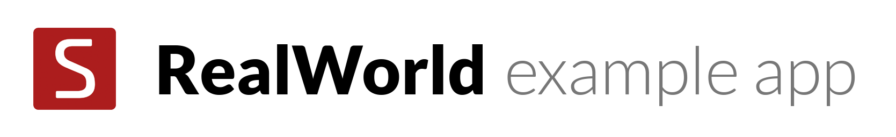

# 

> ### [Svelte](https://github.com/sveltejs/svelte) codebase containing real world examples (CRUD, auth, advanced patterns, etc) that adheres to the [RealWorld](https://github.com/gothinkster/realworld) spec and API.


### [Demo](https://realworld.svelte.dev)&nbsp;&nbsp;&nbsp;&nbsp;[RealWorld](https://github.com/gothinkster/realworld)


This codebase was created to demonstrate a fully fledged fullstack application built with Svelte including CRUD operations, authentication, routing, pagination, and more.

For more information on how to this works with other frontends/backends, head over to the [RealWorld](https://github.com/gothinkster/realworld) repo.


# Getting started

```bash
npm install
npm run dev
```

...then open [localhost:3000](http://localhost:3000). To build and start in prod mode:

```bash
npm run build
npm start
```

Other Code

```
{#each launch_data as item}
    <UpcomingLaunch {...item}/>
{/each}
```

```
<p> {console.log(item)} </p>
```

```
{#await fetchLaunchData}
    <p> ... Loading Upcoming Launch Data </p>
{:then data} 
    {#each data.result.slice(0, 3) as item}
    <UpcomingLaunch {...item}/>
    {/each}
    {#each data.result as item}
    <UpcomingLaunch {...item}/>
    {/each}
{:catch error}
    <p> {error} </p> 
{/await}
```

```
Old Planetry Code for the GLOBE in 3D

<!-- <canvas id='rotatingGlobe' width='400' height='400' style='width: 400px; height: 400px; cursor: move;'></canvas> -->

onMount(async () => {
    (function() {
    var globe = planetaryjs.planet();
    // Load our custom `autorotate` plugin; see below.
    globe.loadPlugin(autorotate(10));
    // The `earth` plugin draws the oceans and the land; it's actually
    // a combination of several separate built-in plugins.
    //
    // Note that we're loading a special TopoJSON file
    // (world-110m-withlakes.json) so we can render lakes.
    globe.loadPlugin(planetaryjs.plugins.earth({
    topojson: { file:   '/world-110m-withlakes.json' },
    oceans:   { fill:   '#000080' },
    land:     { fill:   '#339966' },
    borders:  { stroke: '#008000' }
    }));
    // Load our custom `lakes` plugin to draw lakes; see below.
    globe.loadPlugin(lakes({
    fill: '#000080'
    }));
    // The `pings` plugin draws animated pings on the globe.
    globe.loadPlugin(planetaryjs.plugins.pings());
    // The `zoom` and `drag` plugins enable
    // manipulating the globe with the mouse.
    globe.loadPlugin(planetaryjs.plugins.zoom({
    scaleExtent: [100, 300]
    }));
    globe.loadPlugin(planetaryjs.plugins.drag({
    // Dragging the globe should pause the
    // automatic rotation until we release the mouse.
    onDragStart: function() {
        this.plugins.autorotate.pause();
    },
    onDragEnd: function() {
        this.plugins.autorotate.resume();
    }
    }));
    // Set up the globe's initial scale, offset, and rotation.
    globe.projection.scale(175).translate([175, 175]).rotate([0, -10, 0]);

    // Every few hundred milliseconds, we'll draw another random ping.
    var colors = ['red', 'yellow', 'white', 'orange', 'green', 'cyan', 'pink'];
    setInterval(function() {
    var lat = Math.random() * 170 - 85;
    var lng = Math.random() * 360 - 180;
    var color = colors[Math.floor(Math.random() * colors.length)];
    globe.plugins.pings.add(lng, lat, { color: color, ttl: 2000, angle: Math.random() * 10 });
    }, 150);

    var canvas = document.getElementById('rotatingGlobe');
    // Special code to handle high-density displays (e.g. retina, some phones)
    // In the future, Planetary.js will handle this by itself (or via a plugin).
    if (window.devicePixelRatio == 2) {
    canvas.width = 800;
    canvas.height = 800;
    context = canvas.getContext('2d');
    context.scale(2, 2);
    }
    // Draw that globe!
    globe.draw(canvas);

    // This plugin will automatically rotate the globe around its vertical
    // axis a configured number of degrees every second.
    function autorotate(degPerSec) {
    // Planetary.js plugins are functions that take a `planet` instance
    // as an argument...
    return function(planet) {
        var lastTick = null;
        var paused = false;
        planet.plugins.autorotate = {
        pause:  function() { paused = true;  },
        resume: function() { paused = false; }
        };
        // ...and configure hooks into certain pieces of its lifecycle.
        planet.onDraw(function() {
        if (paused || !lastTick) {
            lastTick = new Date();
        } else {
            var now = new Date();
            var delta = now - lastTick;
            // This plugin uses the built-in projection (provided by D3)
            // to rotate the globe each time we draw it.
            var rotation = planet.projection.rotate();
            rotation[0] += degPerSec * delta / 1000;
            if (rotation[0] >= 180) rotation[0] -= 360;
            planet.projection.rotate(rotation);
            lastTick = now;
        }
        });
    };
    };

    // This plugin takes lake data from the special
    // TopoJSON we're loading and draws them on the map.
    function lakes(options) {
    options = options || {};
    var lakes = null;

    return function(planet) {
        planet.onInit(function() {
        // We can access the data loaded from the TopoJSON plugin
        // on its namespace on `planet.plugins`. We're loading a custom
        // TopoJSON file with an object called "ne_110m_lakes".
        var world = planet.plugins.topojson.world;
        lakes = topojson.feature(world, world.objects.ne_110m_lakes);
        });

        planet.onDraw(function() {
        planet.withSavedContext(function(context) {
            context.beginPath();
            planet.path.context(context)(lakes);
            context.fillStyle = options.fill || 'black';
            context.fill();
        });
        });
    };
    };
})();
})

```


